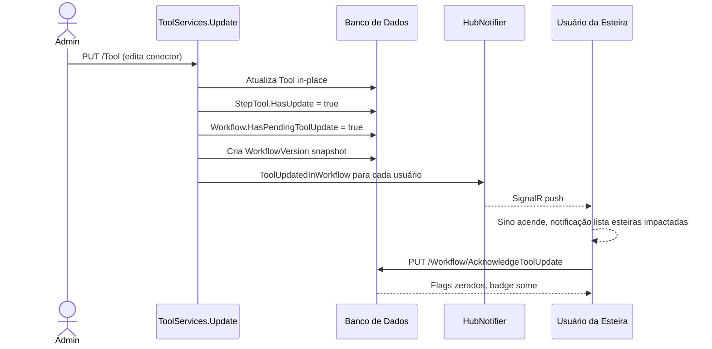

# Tool Versioning — Plano Revisado

## Mudança de Abordagem

A versão anterior propunha versionamento imutável de ferramentas (criar novo registro `Tool` a cada update). O novo escopo é mais simples e centrado no **workflow**:

- Ferramentas são atualizadas **in-place** (comportamento atual preservado)
- A **esteira** recebe um flag `HasPendingToolUpdate` e opcionalmente um snapshot versionado
- Usuários que trabalham na esteira são **notificados via sininho** (SignalR)
- A esteira continua funcionando normalmente; o flag é informativo/governança



---

## Backend

### 1. Migration — novos campos e tabela

**[`back-end/WoopiAiHub.Domain/Models/Workflow.cs`](back-end/WoopiAiHub.Domain/Models/Workflow.cs)**
```csharp
public bool HasPendingToolUpdate { get; set; } = false;
public ICollection<WorkflowVersion> Versions { get; set; } = new List<WorkflowVersion>();
```

**[`back-end/WoopiAiHub.Domain/Models/StepTool.cs`](back-end/WoopiAiHub.Domain/Models/StepTool.cs)**
```csharp
public bool HasUpdate { get; set; } = false;
```

**Novo [`back-end/WoopiAiHub.Domain/Models/WorkflowVersion.cs`](back-end/WoopiAiHub.Domain/Models/WorkflowVersion.cs)** — snapshot imutável da configuração da esteira no momento da mudança:
```csharp
public Guid Id { get; set; }
public Guid WorkflowId { get; set; }
public Workflow Workflow { get; set; }
public int VersionNumber { get; set; }        // auto-increment por workflow
public string ConfigSnapshot { get; set; }    // JSON serializado de Steps + StepTools + parâmetros
public string TriggerToolName { get; set; }   // nome da ferramenta que causou o snapshot
public Guid TriggerToolId { get; set; }
public DateTime Created { get; set; }
```

Migration: `back-end/WoopiAiHub.Repository/Migrations/`  
DbSet novo: `WorkflowVersions` em `ApplicationDbContext`.

---

### 2. Novos endpoints no `ToolController`

**[`back-end/WoopiAiHub.Api/Controllers/ToolController.cs`](back-end/WoopiAiHub.Api/Controllers/ToolController.cs)**

| Método | Rota | Descrição |
|--------|------|-----------|
| `GET` | `/Tool/{id}/UsedInWorkflows` | Retorna `[{workflowId, workflowName}]` para exibir no modal de impacto |

**[`back-end/WoopiAiHub.Api/Controllers/WorkflowController.cs`](back-end/WoopiAiHub.Api/Controllers/WorkflowController.cs)** (ou novo `WorkflowVersionController`)

| Método | Rota | Descrição |
|--------|------|-----------|
| `PUT` | `/Workflow/{id}/AcknowledgeToolUpdate` | Zera `HasPendingToolUpdate` e `StepTool.HasUpdate` |
| `GET` | `/Workflow/{id}/Versions` | Lista snapshots de versão da esteira (opcional, auditoria) |

---

### 3. Alterar `ToolServices.Update` — lógica central

**[`back-end/WoopiAiHub.Application/Services/ToolServices.cs`](back-end/WoopiAiHub.Application/Services/ToolServices.cs)**

Após salvar o Tool in-place, executar em sequência:

1. Buscar todos `StepTool` com `ToolId = tool.Id` → obter `Step.WorkflowId` distintos
2. Para cada workflow afetado:
   - Marcar `StepTool.HasUpdate = true` nos StepTools do workflow
   - Marcar `Workflow.HasPendingToolUpdate = true`
   - Criar `WorkflowVersion` com JSON snapshot das Steps + StepTools atuais
3. Coletar emails dos usuários: `Workflow → WorkflowTeams → Team → UserTeams → User.Email`
4. Para cada email: `_hubNotifier.NotifyToolUpdatedInWorkflow(email, payload)`

---

### 4. Novo evento SignalR — `ToolUpdatedInWorkflow`

**[`back-end/WoopiAiHub.Domain/Interfaces/Hubs/IHubNotifier.cs`](back-end/WoopiAiHub.Domain/Interfaces/Hubs/IHubNotifier.cs)**
```csharp
Task NotifyToolUpdatedInWorkflowAsync(string userEmail, ToolUpdatedInWorkflowDto payload);
```

**[`back-end/WoopiAiHub.Api/Hubs/HubNotifier.cs`](back-end/WoopiAiHub.Api/Hubs/HubNotifier.cs)**
```csharp
// payload enviado ao cliente
{ workflowId, workflowName, toolName, toolId, updatedAt }
```

Segue o padrão de `NotifyAnonymizationReadyAsync` já existente: lookup de connectionIds via `ConnectionMappingService` → `SendAsync("ToolUpdatedInWorkflow", payload)`.

---

### 5. `HasOutdatedTools` no DTO de listagem de workflows

**DTO de resposta do workflow** (ex: `WorkflowResponseDto`) — campo derivado:
```csharp
public bool HasPendingToolUpdate { get; set; }
```
Populado direto de `Workflow.HasPendingToolUpdate` (já está na entidade após migration).

---

## Frontend

### 6. RF01 — Modal de impacto em `ToolsModal.vue`

**[`front-end/vueapp/src/components/tools/ToolsModal.vue`](front-end/vueapp/src/components/tools/ToolsModal.vue)**

No método `save()`, antes de chamar `ToolsServices.editTool()`:
1. Chamar `GET /Tool/{id}/UsedInWorkflows`
2. Se retornar workflows → abrir `ToolImpactModal.vue`
3. Ao confirmar → chamar `editTool()` normalmente

**[`front-end/vueapp/src/components/tools/ToolImpactModal.vue`](front-end/vueapp/src/components/tools/ToolImpactModal.vue)** — segue o padrão de `PromptDependencyDeleteModal.vue`:

- Header âmbar (`TriangleAlert`) — _"Ferramenta utilizada em X esteira(s)"_
- Lista scrollável com nome das esteiras + botão "Configurar ↗" (`window.open('/workflow/edit/{id}/3')`)
- Alerta âmbar (`OctagonAlert`): _"Os responsáveis pelas esteiras serão notificados. A ferramenta será atualizada imediatamente, mas os administradores das esteiras precisarão confirmar a atualização nas configurações."_
- Botões: "Cancelar" + "Salvar e notificar" (variante `warning`, spinner durante o save)

---

### 7. Notificação no sininho — `defaultLayout.vue` + `NavbarNotificationComponent.vue`

**[`front-end/vueapp/src/layouts/defaultLayout.vue`](front-end/vueapp/src/layouts/defaultLayout.vue)**

Registrar novo listener SignalR ao lado de `AnonymizationReady`:
```js
signalRService.on("ToolUpdatedInWorkflow", (payload) => {
    this.$store.commit("addToolUpdateNotification", {
        id: `tool-update-${payload.workflowId}-${Date.now()}`,
        type: "tool-update",
        workflowId: payload.workflowId,
        workflowName: payload.workflowName,
        toolName: payload.toolName,
        status: "unread",
    });
});
```

**[`front-end/vueapp/src/store/index.js`](front-end/vueapp/src/store/index.js)**

Nova mutation `addToolUpdateNotification` que faz push em `uploadNotifications` (ou em lista separada `toolUpdateNotifications`).

**[`front-end/vueapp/src/components/layout/NavbarNotificationComponent.vue`](front-end/vueapp/src/components/layout/NavbarNotificationComponent.vue)**

Novo template de item para `type === 'tool-update'`:

```
┌─────────────────────────────────────────────────────┐
│  ⚠  Ferramenta atualizada                          │
│     "OCR Extractor" foi alterada                   │
│     Esteira: Análise de Contratos                  │
│     → Revisar configuração                         │  ← link para /workflow/edit/{id}/3
└─────────────────────────────────────────────────────┘
```

---

### 8. RF02 + RF03 — Badges e ação de confirmação

Os três pontos de superfície permanecem os mesmos do plano anterior, usando `hasUpdate` / `hasPendingToolUpdate`:

**8a. `Phase3Tools.vue`** — badge âmbar + botão "Confirmar atualização" por step afetado → `PUT /Workflow/{id}/AcknowledgeToolUpdate`

**8b. `WorkflowTable.vue`** — ícone `AlertTriangle` âmbar na linha da esteira quando `row.hasPendingToolUpdate`

**8c. `WorkflowsKanbanComponent.vue`** — badge âmbar no trigger do selector e nos itens do dropdown quando `item.hasPendingToolUpdate`

---

## Sequência de entregas

1. Backend: migration + modelos (`Workflow`, `StepTool`, `WorkflowVersion`)
2. Backend: `GET /Tool/{id}/UsedInWorkflows`
3. Backend: lógica em `ToolServices.Update` — flags + snapshot + notificação
4. Backend: evento `ToolUpdatedInWorkflow` no `IHubNotifier` / `HubNotifier`
5. Backend: `PUT /Workflow/{id}/AcknowledgeToolUpdate` + testes
6. Frontend: modal de impacto RF01 (`ToolImpactModal.vue`)
7. Frontend: SignalR listener + Vuex + sino (`NavbarNotificationComponent`)
8. Frontend: badges RF02 nos três pontos de superfície
9. Frontend: botão "Confirmar atualização" RF03 em Phase3Tools
10. Mock: `mockApiRouter.js` + `mockFixtures.js` (eventos simulados e flags)
