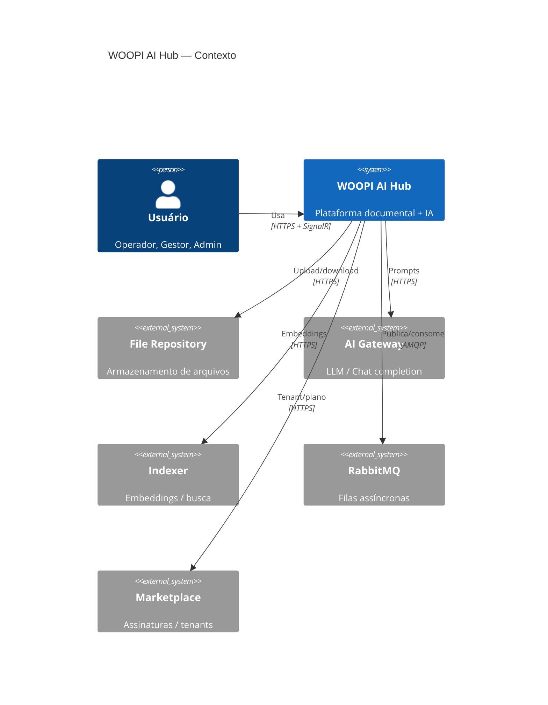
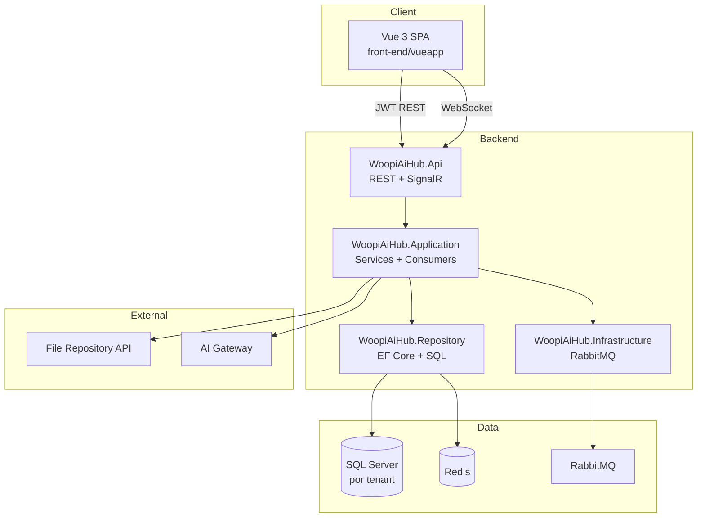
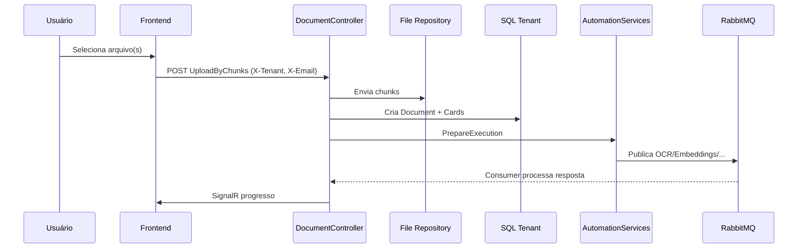
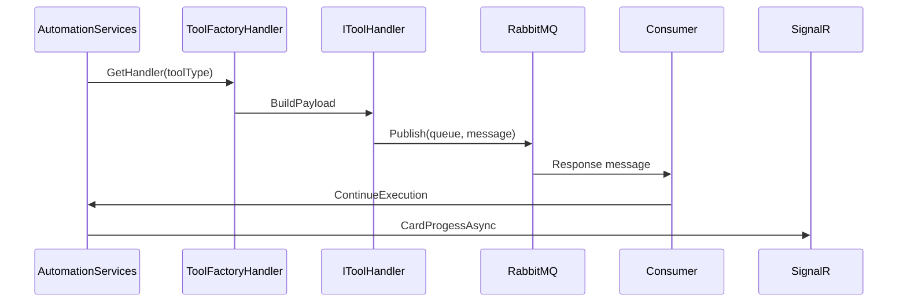
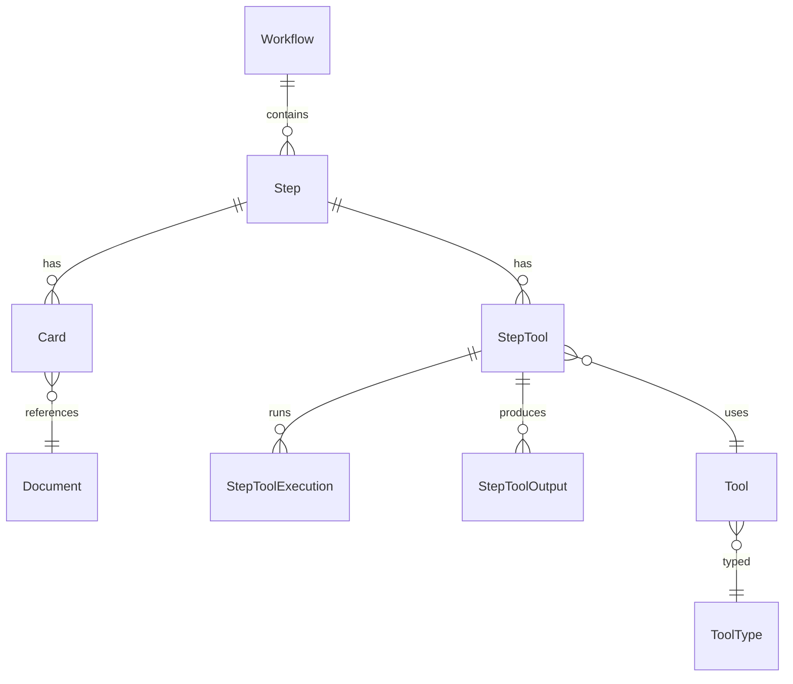

# 02 — Diagramas

> Parte de [`../README.md`](../README.md) · Arquitetura do sistema

---

## C4 — Contexto (Nível 1)



---

## C4 — Contêineres (Nível 2)



---

## Sequência — Upload e entrada na esteira



---

## Sequência — Automação de ferramentas



---

## Frontend — Layout autenticado

```
┌─────────────┬──────────────────────────────────────┐
│  Sidebar    │  Navbar (tenant, 🔔, tema, idioma)   │
│  240/60px   ├──────────────────────────────────────┤
│             │  Conteúdo (router-view)               │
│  Menu       │  padding 70px @ ≥1025px                │
└─────────────┴──────────────────────────────────────┘
```

Ver PRODUCT_DESIGN §2.

---

## Modelo esteira (simplificado)



Detalhe entidades → [`../04-design-detalhado/01-modelo-dados.md`](../04-design-detalhado/01-modelo-dados.md)

---

## Documentação relacionada

- Visão arquitetural → [`01-visao-arquitetural.md`](./01-visao-arquitetural.md)
- Fluxos de negócio → [`../04-design-detalhado/04-fluxos.md`](../04-design-detalhado/04-fluxos.md)
