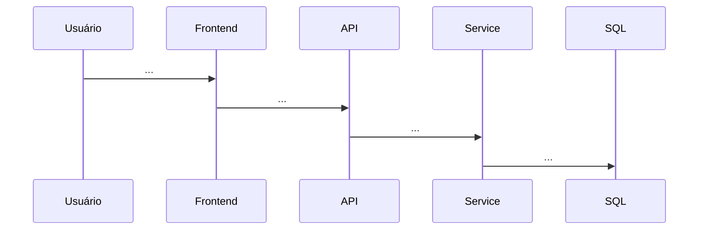

# Template — Nova Funcionalidade (SDD)

> Copie este arquivo para `{nome-feature}-spec.md` e preencha **antes** da implementação.

---

## Metadados

| Campo | Valor |
|-------|-------|
| **Feature** | |
| **Autor** | |
| **Data** | |
| **Status** | Rascunho / Aprovado / Implementado |
| **Módulo** | Document / Workflow / Tools / Management / Outro |

---

## 1. Contexto e motivação

<!-- Por que esta feature existe? Qual dor resolve? -->

---

## 2. Objetivo

<!-- Uma frase clara do resultado esperado -->

---

## 3. Escopo

### Dentro do escopo
-

### Fora do escopo
-

---

## 4. Requisitos funcionais

| ID | Requisito | Ator |
|----|-----------|------|
| RF- | | Operador / Gestor / Admin / Sistema |

### Fluxo principal
1.
2.
3.

### Fluxos alternativos / erro
-

### Regras de negócio
| ID | Regra |
|----|-------|
| RN- | |

---

## 5. Requisitos não funcionais

| ID | RNF | Detalhe |
|----|-----|---------|
| | Performance / Segurança / UX | |

---

## 6. Permissões

| Module | Action | Quem acessa |
|--------|--------|-------------|
| | | |

Menu sidebar: sim / não — labelKey: `pages.___`

---

## 7. Modelo de dados

### Novas entidades (se houver)

| Entidade | Campos principais | Relações |
|----------|-------------------|----------|
| | | |

### Migration
- Nome: `____________________`
- Índices necessários:

### Alterações em entidades existentes
-

---

## 8. API (Backend)

| Método | Rota | Descrição | Request | Response |
|--------|------|-----------|---------|----------|
| GET | /api/... | | | |

### Headers
- [ ] X-Email, X-Tenant, X-Language

### Erros esperados (labelError)
| Cenário | ErrorCode | labelError |
|---------|-----------|------------|
| | NotFound | |

### Assíncrono?
- [ ] Não — HTTP sync
- [ ] Sim — ToolHandler tipo: ______ / Consumer: ______ / Fila: ______

---

## 9. UI (Frontend)

### Rotas Vue

| Rota | Nome | Layout | Permissão |
|------|------|--------|-----------|
| | | default | |

### Componentes reutilizados
- [ ] TableComponent
- [ ] ModalComponent / ConfirmModal
- [ ] PaginationComponent
- [ ] SearchComponent
- [ ] Outro: ___

### Wireframe (descrição ou link)
```
[Descrever layout: título, filtros, tabela, ações]
```

### i18n — chaves novas

```javascript
// pt.js (espelhar en.js, es.js)
meuModulo: {
    title: '',
    subtitle: '',
    // ...
}
```

---

## 10. Fluxo técnico



---

## 11. Testes

| ID | Cenário | Tipo |
|----|---------|------|
| TC-01 | Happy path | Unit |
| TC-02 | Not found | Unit |

Fixture: `MeuFixture.cs` — sim / não

---

## 12. Segurança

- [ ] Multitenancy validado
- [ ] Parâmetros sensíveis criptografados (se aplicável)
- [ ] Permissões backend + frontend
- [ ] Sem secrets em resposta/log

---

## 13. Critérios de aceite

- [ ] RF implementados
- [ ] i18n pt/en/es
- [ ] Tema dark ok
- [ ] Testes unitários Services passando
- [ ] Swagger documentado (se novos endpoints)
- [ ] SDD seções 02/04 atualizadas

---

## 14. Referências

- Arquivos similares no repo:
- Docs: PRODUCT_DESIGN §___ | BACKEND_ARCHITECTURE §___

---

## Histórico de revisões

| Data | Autor | Alteração |
|------|-------|-----------|
| | | Criação |
